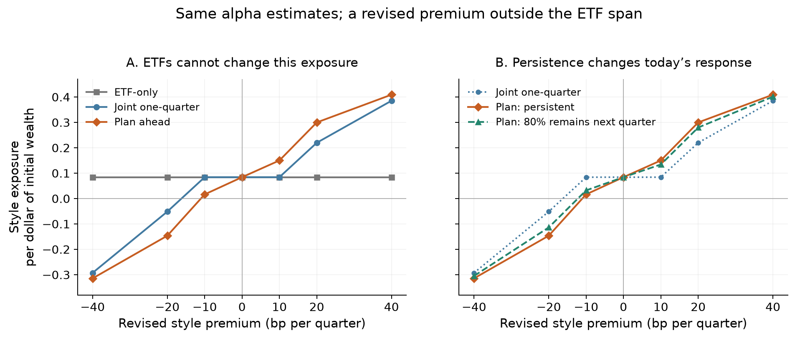

# Forecast direction, persistence and missing ETF span

All inputs are assumed. This extends the controlled old-optimal-incumbent comparison under existing M9; no new theorem or formal source was added. The findings concern the selected conditional forecast scenarios, not empirical performance.

## Economic distinctions

- The original menu spans equity, duration and credit, but a zero ETF holding prevents a sale in that instrument. In the credit-premium cut, the best ETF-only action is no trade while the joint policy sells credit funds.
- Adding an economic style factor with zero ETF loadings creates an algebraically missing direction. Alpha remains defined after all four factors. A style-premium revision changes fund selection without an alpha revision.
- At the baseline style prior SD, +/-10 bp style revisions produce no current one-quarter trade but opposite fund switches under planning. Total ETF holdings remain essentially unchanged in both cases.
- Persistent and partly reverting revisions have identical current means and uncertainty, hence the same one-quarter decisions. Their planning decisions differ.
- Each menu and uncertainty specification gets its own old optimal portfolio. All old one-quarter controls make no material trade. No historical trading path or long-run attractor is asserted.



## Full baseline style grid

Style exposure is a factor sensitivity per dollar of initial wealth, not an allocation weight. Negative values can arise from nonnegative holdings in funds with negative style loadings. The old style exposure is about 0.0842; all old alphas are unchanged throughout the grid.

| Revision, bp | Forecast | ETF-only exposure | One-quarter exposure | Planning exposure | One-quarter ETF % | Planning ETF % | Planning gain, bp |
|---:|---|---:|---:|---:|---:|---:|---:|
| -40 | persistent | 0.0842 | -0.2927 | -0.3144 | 21.86 | 21.82 | 0.20212 |
| -20 | persistent | 0.0842 | -0.0514 | -0.1463 | 21.86 | 23.82 | 0.53399 |
| -10 | persistent | 0.0842 | 0.0842 | 0.0165 | 21.86 | 21.86 | 0.28419 |
| 0 | persistent | 0.0842 | 0.0842 | 0.0842 | 21.86 | 21.86 | 0.00000 |
| 10 | persistent | 0.0842 | 0.0842 | 0.1501 | 21.86 | 21.86 | 0.26963 |
| 20 | persistent | 0.0842 | 0.2198 | 0.2999 | 21.86 | 19.43 | 0.49108 |
| 40 | persistent | 0.0842 | 0.3853 | 0.4093 | 1.88 | 0.00 | 0.22264 |
| -40 | reverting | 0.0842 | -0.2927 | -0.3049 | 21.86 | 21.86 | 0.07292 |
| -20 | reverting | 0.0842 | -0.0514 | -0.1138 | 21.86 | 22.95 | 0.24382 |
| -10 | reverting | 0.0842 | 0.0842 | 0.0322 | 21.86 | 21.86 | 0.17423 |
| 0 | reverting | 0.0842 | 0.0842 | 0.0842 | 21.86 | 21.86 | 0.00000 |
| 10 | reverting | 0.0842 | 0.0842 | 0.1342 | 21.86 | 21.86 | 0.16234 |
| 20 | reverting | 0.0842 | 0.2198 | 0.2799 | 21.86 | 20.73 | 0.22883 |
| 40 | reverting | 0.0842 | 0.3853 | 0.4014 | 1.88 | 0.00 | 0.07728 |

## Other revised forecasts

| Scenario | Revision, bp | One-quarter ETF % | Planning ETF % | Current fund-trading benefit, bp | Planning gain, bp |
|---|---:|---:|---:|---:|---:|
| unchanged | 0 | 20.47 | 20.47 | 0.00000 | 0.00000 |
| duration_up | 10 | 18.41 | 18.54 | 0.02685 | 0.26165 |
| duration_down | -10 | 22.78 | 22.46 | 0.04133 | 0.22136 |
| credit_premium_up | 15 | 29.25 | 22.09 | 0.23113 | 0.30667 |
| credit_premium_down | -15 | 25.73 | 27.60 | 0.34593 | 0.42060 |
| credit_alpha_up | 5 | 20.47 | 19.19 | 0.00000 | 0.02164 |
| credit_alpha_down | -5 | 20.47 | 21.30 | 0.00000 | 0.00930 |

## Scope and checks

The complete 49-case grid has median planning gain 0.21151 bp and maximum 0.53735 bp. Those figures describe assumed inputs, not a test of whether the research direction is useful. The largest current one-quarter score benefit from allowing fund trades is 6.30008 bp; this is a different comparison from planning.

The ETF-only invariance check passes at all three prior SDs. Its economic reason is exact: with funds fixed and every ETF loading zero, the style premium multiplies the same inherited style exposure in every current feasible ETF action. No change to a fund alpha estimate is involved. The check says nothing about a policy that can trade funds at the current review, or a different future objective.

All joint final solves returned optimal. One case (ID 28) required two retries with the documented stopping settings. The original run records 4 accuracy warnings and 220 CVXPY compilation-size warnings; none is silently dropped. Every root and future budget passed the registered checks. Maximum objective reconstruction error is 1.19e-12; minimum future cash is -9e-12, within solver tolerance.

Independent direct-tree/vectorized-QP checks cover 49 cases. Maximum holding error is 4.74e-07, value error 2.35e-06 bp and planning-gain error 2.39e-06 bp. Independent warnings: 0. This is numerical reproduction, not machine-checked formalization or a change in lab evidence status.

The additional factor is independent of the original factors by assumption. A correlated missing direction would require separating the part hedgeable through ETFs; Appendix B.2 gives that reduction under its unconstrained quadratic assumptions. The funded illustrations here do not claim that its closed-form policy transfers.

The seven plotted points are solved scenarios; connecting lines do not locate exact thresholds. Larger gains were not a design objective. Complete holdings, costs, factor exposures and all 49 cases remain in [results.json](results.json) and [results.csv](results.csv). See [DESIGN.md](DESIGN.md) for inputs and numerical deviations, and [verification_comparison.json](verification_comparison.json) for independent errors.

```bash
.venv/bin/python manuscript2/analysis/forecast_extension/run.py
.venv/bin/python manuscript2/analysis/forecast_extension/verify.py
.venv/bin/python manuscript2/analysis/forecast_extension/report.py
```
